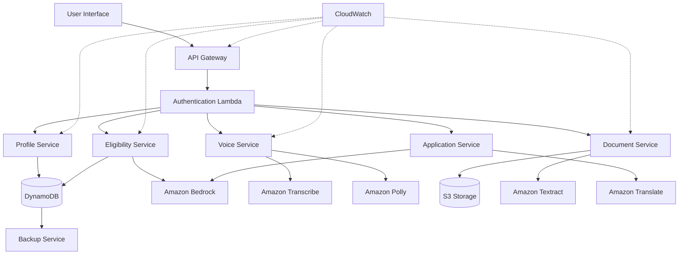

# Design Document: GramSaarthi AI
## Design Goals

1. Ensure accessibility for rural users with low digital literacy.
2. Maintain strict privacy and consent-based data handling.
3. Achieve horizontal scalability using serverless architecture.
4. Provide resilient fallback mechanisms for AI service failures.
5. Enable easy onboarding of new government schemes.

## Overview

GramSaarthi AI is a serverless, AI-powered civic access platform built on AWS infrastructure. The system uses a microservices architecture with API Gateway as the entry point, Lambda functions for business logic, DynamoDB for data persistence, and S3 for document storage. AI capabilities are provided through Amazon Bedrock for language understanding and generation, Textract for OCR, Translate for multilingual support, Transcribe for speech-to-text, and Polly for text-to-speech.

The design prioritizes:
- **Accessibility**: Voice-first interface with multilingual support
- **Privacy**: Consent-based data handling with encryption
- **Scalability**: Serverless architecture that scales automatically
- **Resilience**: Graceful degradation when AI services are unavailable
- **Simplicity**: Intuitive interaction flow for low digital literacy users

## Assumptions & Constraints

- Users may have intermittent internet connectivity.
- Government scheme data is updated periodically via admin workflows.
- AI services may experience latency; fallback mechanisms are required.
- MVP does not directly integrate with government portals but redirects users.
- Target deployment: Pilot at district level before nationwide scaling.
## Architecture

### High-Level Architecture



### Service Decomposition

The system is decomposed into six core services:

1. **Authentication Service**: Manages user sessions and consent records
2. **Profile Service**: Handles user profile CRUD operations
3. **Eligibility Service**: Matches users with schemes using AI
4. **Voice Service**: Provides speech-to-text and text-to-speech capabilities
5. **Document Service**: Processes uploaded documents with OCR
6. **Application Service**: Provides scheme guidance and translations

### Technology Stack

- **API Layer**: AWS API Gateway with REST endpoints
- **Compute**: AWS Lambda (Node.js 20.x runtime)
- **Storage**: DynamoDB (user profiles, schemes, sessions), S3 (documents)
- **AI Services**: Bedrock (Claude 3), Textract, Translate, Transcribe, Polly
- **Security**: AWS IAM, KMS for encryption, Cognito for authentication
- **Monitoring**: CloudWatch Logs, CloudWatch Metrics, X-Ray for tracing

## Components and Interfaces

### 1. Authentication Service

**Responsibility**: Manage user sessions, consent records, and authentication tokens.

**Interface**:
```typescript
interface AuthenticationService {
  createSession(deviceId: string, language: string): Session
  validateSession(sessionId: string): SessionValidation
  recordConsent(sessionId: string, consentGiven: boolean): ConsentRecord
  getConsent(sessionId: string): ConsentRecord | null
  endSession(sessionId: string): void
}

interface Session {
  sessionId: string
  deviceId: string
  language: string
  createdAt: number
  expiresAt: number
}

interface ConsentRecord {
  sessionId: string
  consentGiven: boolean
  timestamp: number
  version: string
}
```

**Implementation Notes**:
- Sessions expire after 24 hours of inactivity
- Session IDs are UUIDs generated using crypto.randomUUID()
- Consent records are immutable once created
- DynamoDB TTL automatically removes expired sessions

### 2. Profile Service

**Responsibility**: Store and retrieve user profile information with encryption.

**Interface**:
```typescript
interface ProfileService {
  createProfile(sessionId: string, profile: UserProfile): ProfileResult
  getProfile(sessionId: string): UserProfile | null
  updateProfile(sessionId: string, updates: Partial<UserProfile>): ProfileResult
  deleteProfile(sessionId: string): void
}

interface UserProfile {
  sessionId: string
  age: number
  occupation: string
  incomeRange: IncomeRange
  location: Location
  category: Category
  createdAt: number
  updatedAt: number
}

interface Location {
  state: string
  district: string
  pincode?: string
}

enum IncomeRange {
  BPL = "BPL",
  BELOW_2_LAKH = "BELOW_2_LAKH",
  TWO_TO_FIVE_LAKH = "2_TO_5_LAKH",
  FIVE_TO_TEN_LAKH = "5_TO_10_LAKH",
  ABOVE_TEN_LAKH = "ABOVE_10_LAKH"
}

enum Category {
  GENERAL = "GENERAL",
  OBC = "OBC",
  SC = "SC",
  ST = "ST",
  EWS = "EWS"
}
```

**Implementation Notes**:
- Sensitive fields (age, income, category) are encrypted using AWS KMS
- Profile data is stored in DynamoDB with sessionId as partition key
- Updates are atomic using DynamoDB UpdateItem
- Deletion is immediate and permanent

### 3. Eligibility Service

**Responsibility**: Match user profiles with government schemes using AI-powered analysis.

**Interface**:
```typescript
interface EligibilityService {
  findEligibleSchemes(profile: UserProfile): Promise<EligibilityResult[]>
  validateEligibility(profile: UserProfile, schemeId: string): Promise<ValidationResult>
  rankSchemes(matches: EligibilityResult[]): EligibilityResult[]
}

interface EligibilityResult {
  schemeId: string
  schemeName: string
  relevanceScore: number
  matchedCriteria: string[]
  benefits: string
  eligibilitySummary: string
}

interface ValidationResult {
  eligible: boolean
  matchedCriteria: string[]
  unmatchedCriteria: string[]
  requiredDocuments: string[]
  additionalRequirements: string[]
}

interface Scheme {
  schemeId: string
  name: string
  description: string
  level: "CENTRAL" | "STATE"
  state?: string
  eligibilityCriteria: EligibilityCriteria
  benefits: string
  applicationProcess: string
  requiredDocuments: string[]
  officialUrl: string
  active: boolean
}

interface EligibilityCriteria {
  minAge?: number
  maxAge?: number
  occupations?: string[]
  incomeRanges?: IncomeRange[]
  states?: string[]
  categories?: Category[]
}
```

**Implementation Notes**:
- Schemes are stored in DynamoDB with schemeId as partition key
- State-level schemes have a GSI on state for efficient querying
- AI matching uses Amazon Bedrock with Claude 3 Haiku for speed
- Prompt engineering ensures structured JSON responses
- Relevance scoring combines exact matches (70%) and AI similarity (30%)
- Fallback to rule-based matching if Bedrock is unavailable

**AI Prompt Template**:
```
Analyze the following user profile and scheme eligibility criteria.
Determine if the user is eligible and provide a relevance score (0-100).

User Profile:
- Age: {age}
- Occupation: {occupation}
- Income Range: {incomeRange}
- Location: {state}, {district}
- Category: {category}

Scheme Criteria:
{eligibilityCriteria}

Respond in JSON format:
{
  "eligible": boolean,
  "relevanceScore": number,
  "matchedCriteria": string[],
  "reasoning": string
}
```

### 4. Voice Service

**Responsibility**: Convert speech to text and text to speech in multiple Indian languages.

**Interface**:
```typescript
interface VoiceService {
  speechToText(audioData: Buffer, language: string): Promise<TranscriptionResult>
  textToSpeech(text: string, language: string): Promise<AudioResult>
  detectLanguage(audioData: Buffer): Promise<string>
}

interface TranscriptionResult {
  text: string
  confidence: number
  language: string
}

interface AudioResult {
  audioData: Buffer
  format: string
  duration: number
}
```

**Implementation Notes**:
- Audio files are temporarily stored in S3 with 1-hour TTL
- Amazon Transcribe supports Hindi, Tamil, Telugu, and other Indian languages
- Amazon Polly uses neural voices for natural-sounding speech
- Confidence threshold of 0.7 for accepting transcriptions
- Low confidence triggers re-prompt to user
- Audio format: MP3 at 24kbps for bandwidth efficiency

**Language Mapping**:
```typescript
const LANGUAGE_CODES = {
  "hi": "hi-IN",  // Hindi
  "en": "en-IN",  // English
  "ta": "ta-IN",  // Tamil
  "te": "te-IN",  // Telugu
  "bn": "bn-IN",  // Bengali
  "mr": "mr-IN",  // Marathi
  "gu": "gu-IN",  // Gujarati
  "kn": "kn-IN",  // Kannada
  "ml": "ml-IN",  // Malayalam
  "pa": "pa-IN"   // Punjabi
}
```

### 5. Document Service

**Responsibility**: Process uploaded documents using OCR and extract structured information.

**Interface**:
```typescript
interface DocumentService {
  uploadDocument(sessionId: string, documentData: Buffer, documentType: string): Promise<UploadResult>
  extractInformation(documentId: string): Promise<ExtractionResult>
  validateDocument(documentId: string, expectedType: string): Promise<ValidationResult>
}

interface UploadResult {
  documentId: string
  s3Key: string
  uploadedAt: number
}

interface ExtractionResult {
  documentId: string
  extractedFields: Record<string, string>
  confidence: number
  rawText: string
}

interface DocumentField {
  fieldName: string
  value: string
  confidence: number
  boundingBox?: BoundingBox
}
```

**Implementation Notes**:
- Documents stored in S3 with server-side encryption (SSE-KMS)
- Amazon Textract extracts text and form data
- Field extraction uses pattern matching for common document types:
  - Aadhaar: 12-digit number, name, DOB, address
  - PAN: 10-character alphanumeric, name
  - Income Certificate: name, annual income, issuing authority
  - Ration Card: card number, family members, address
- Confidence threshold of 0.8 for auto-population
- Low confidence fields require user confirmation
- Documents are retained for 30 days then auto-deleted

**Field Extraction Patterns**:
```typescript
const DOCUMENT_PATTERNS = {
  AADHAAR: {
    number: /\d{4}\s?\d{4}\s?\d{4}/,
    dob: /\d{2}\/\d{2}\/\d{4}/
  },
  PAN: {
    number: /[A-Z]{5}\d{4}[A-Z]/
  },
  INCOME_CERTIFICATE: {
    income: /(?:Rs\.?|INR)\s?(\d+(?:,\d+)*)/
  }
}
```

### 6. Application Service

**Responsibility**: Provide scheme guidance, translations, and application instructions.

**Interface**:
```typescript
interface ApplicationService {
  getSchemeDetails(schemeId: string, language: string): Promise<SchemeDetails>
  getApplicationGuidance(schemeId: string, language: string): Promise<ApplicationGuidance>
  translateContent(text: string, targetLanguage: string): Promise<string>
  simplifyDescription(text: string, language: string): Promise<string>
}

interface SchemeDetails {
  schemeId: string
  name: string
  description: string
  benefits: string
  eligibility: string
  language: string
}

interface ApplicationGuidance {
  steps: ApplicationStep[]
  requiredDocuments: string[]
  estimatedTime: string
  officialUrl: string
  offlineOptions?: OfflineOption[]
}

interface ApplicationStep {
  stepNumber: number
  instruction: string
  tips?: string[]
}

interface OfflineOption {
  officeName: string
  address: string
  contactNumber?: string
  workingHours: string
}
```

**Implementation Notes**:
- Amazon Translate for initial translation
- Amazon Bedrock for simplification and localization
- Translations cached in DynamoDB for 7 days
- Simplification prompt focuses on 5th-grade reading level
- Application steps are templated with scheme-specific details
- Offline options queried from government office database

**Simplification Prompt Template**:
```
Simplify the following government scheme description for a rural citizen with basic literacy.
Use simple words, short sentences, and explain benefits clearly.
Target language: {language}
Reading level: 5th grade

Original text:
{schemeDescription}

Provide simplified version in {language}.
```

## Data Models

### DynamoDB Tables

#### 1. Sessions Table
```typescript
interface SessionRecord {
  sessionId: string          // Partition Key
  deviceId: string
  language: string
  consentGiven: boolean
  consentTimestamp?: number
  consentVersion?: string
  createdAt: number
  expiresAt: number          // TTL attribute
}
```

**Indexes**: None
**TTL**: expiresAt field (24 hours from creation)

#### 2. Profiles Table
```typescript
interface ProfileRecord {
  sessionId: string          // Partition Key
  age: string                // Encrypted
  occupation: string
  incomeRange: string        // Encrypted
  state: string
  district: string
  pincode?: string
  category: string           // Encrypted
  createdAt: number
  updatedAt: number
  ttl: number                // TTL attribute (30 days)
}
```

**Indexes**: None
**TTL**: ttl field (30 days from last update)
**Encryption**: age, incomeRange, category fields encrypted with KMS

#### 3. Schemes Table
```typescript
interface SchemeRecord {
  schemeId: string           // Partition Key
  name: string
  nameTranslations: Record<string, string>
  description: string
  level: string              // "CENTRAL" | "STATE"
  state?: string             // GSI Partition Key
  minAge?: number
  maxAge?: number
  occupations?: string[]
  incomeRanges?: string[]
  states?: string[]
  categories?: string[]
  benefits: string
  applicationProcess: string
  requiredDocuments: string[]
  officialUrl: string
  active: boolean            // GSI Sort Key
  createdAt: number
  updatedAt: number
  version: number
}
```

**Indexes**:
- GSI: StateActiveIndex (state, active)
- GSI: ActiveIndex (active, updatedAt)

#### 4. Documents Table
```typescript
interface DocumentRecord {
  documentId: string         // Partition Key
  sessionId: string          // GSI Partition Key
  s3Key: string
  documentType: string
  extractedFields: Record<string, any>
  confidence: number
  uploadedAt: number
  ttl: number                // TTL attribute (30 days)
}
```

**Indexes**:
- GSI: SessionIndex (sessionId, uploadedAt)
**TTL**: ttl field (30 days from upload)

#### 5. Translations Cache Table
```typescript
interface TranslationRecord {
  cacheKey: string           // Partition Key (hash of source text + target language)
  sourceText: string
  targetLanguage: string
  translatedText: string
  simplified: boolean
  createdAt: number
  ttl: number                // TTL attribute (7 days)
}
```

**Indexes**: None
**TTL**: ttl field (7 days from creation)

### S3 Bucket Structure

```
gram-saarthi-documents/
├── uploads/
│   └── {sessionId}/
│       └── {documentId}.{ext}
├── audio/
│   └── {sessionId}/
│       ├── input-{timestamp}.mp3
│       └── output-{timestamp}.mp3
└── backups/
    └── {date}/
        └── {table}-backup.json
```

**Lifecycle Policies**:
- uploads/: Delete after 30 days
- audio/: Delete after 1 hour
- backups/: Transition to Glacier after 90 days

## Error Handling

### Error Categories

1. **Client Errors (4xx)**:
   - 400 Bad Request: Invalid input data
   - 401 Unauthorized: Invalid or expired session
   - 403 Forbidden: Consent not provided
   - 404 Not Found: Resource doesn't exist
   - 429 Too Many Requests: Rate limit exceeded

2. **Server Errors (5xx)**:
   - 500 Internal Server Error: Unexpected error
   - 502 Bad Gateway: AI service unavailable
   - 503 Service Unavailable: Temporary outage
   - 504 Gateway Timeout: Request timeout

### Error Response Format

```typescript
interface ErrorResponse {
  error: {
    code: string
    message: string
    details?: any
    timestamp: number
    requestId: string
  }
}
```

### Fallback Strategies

1. **AI Service Unavailable**:
   - Eligibility matching: Fall back to rule-based matching
   - Translation: Return English version with notification
   - Simplification: Return original text
   - Voice: Switch to text-based interaction

2. **Database Unavailable**:
   - Return cached data if available
   - Queue write operations for retry
   - Return 503 with retry-after header

3. **Document Processing Failure**:
   - Notify user to re-upload with better quality
   - Offer manual data entry alternative
   - Log failure for admin review

### Retry Logic

```typescript
interface RetryConfig {
  maxAttempts: 3
  initialDelay: 100        // milliseconds
  maxDelay: 2000          // milliseconds
  backoffMultiplier: 2
  retryableErrors: [
    "ServiceUnavailable",
    "ThrottlingException",
    "RequestTimeout"
  ]
}
```

### Circuit Breaker Pattern

```typescript
interface CircuitBreakerConfig {
  failureThreshold: 5      // failures before opening
  successThreshold: 2      // successes before closing
  timeout: 60000          // milliseconds in open state
  monitoredServices: [
    "Bedrock",
    "Textract",
    "Transcribe",
    "Translate",
    "Polly"
  ]
}
```

## Testing Strategy

The testing strategy employs a dual approach combining unit tests for specific scenarios and property-based tests for universal correctness properties.

### Unit Testing

Unit tests focus on:
- Specific examples demonstrating correct behavior
- Edge cases (empty inputs, boundary values, special characters)
- Error conditions and fallback mechanisms
- Integration points between services
- Mock AI service responses for deterministic testing

**Testing Framework**: Jest with AWS SDK mocks
**Coverage Target**: 80% code coverage
**Test Organization**: Co-located with source files

### Property-Based Testing

Property-based tests verify universal properties across randomized inputs:
- Each property test runs minimum 100 iterations
- Tests reference design document properties
- Tag format: **Feature: gram-saarthi-ai, Property {number}: {property_text}**

**Testing Framework**: fast-check (JavaScript property-based testing library)
**Generator Strategy**: Custom generators for UserProfile, Scheme, and other domain objects
**Shrinking**: Automatic minimal failing case identification

### Integration Testing

- End-to-end API tests using actual AWS services in test environment
- Test data cleanup after each test run
- Separate test DynamoDB tables and S3 buckets
- Mock external government portals

### Performance Testing

- Load testing with Artillery or k6
- Target: 10,000 concurrent users
- Response time: p95 < 3 seconds
- Error rate: < 1% under normal load


## Correctness Properties

*A property is a characteristic or behavior that should hold true across all valid executions of a system—essentially, a formal statement about what the system should do. Properties serve as the bridge between human-readable specifications and machine-verifiable correctness guarantees.*

### Property 1: Profile Collection Completeness

*For any* new user session, when profile collection is initiated, all required fields (age, occupation, income range, location, category) must be collected before the profile is considered complete.

**Validates: Requirements 1.1**

### Property 2: Language Consistency

*For any* user session with a selected language, all system responses (text, options, guidance) must be in that selected language.

**Validates: Requirements 1.2, 4.1, 8.1**

### Property 3: Incomplete Profile Validation

*For any* user profile missing one or more required fields, the system must identify and return the specific missing fields.

**Validates: Requirements 1.3**

### Property 4: Profile Storage Round-Trip with Encryption

*For any* valid user profile, storing the profile and then retrieving it must return an equivalent profile, and sensitive fields (age, income, category) must be encrypted in the underlying storage.

**Validates: Requirements 1.4, 1.5, 9.2**

### Property 5: Consent Enforcement

*For any* session where consent is declined, no personal information (profile data) should be stored in persistent storage.

**Validates: Requirements 2.3**

### Property 6: Consent Record Creation

*For any* session where consent is provided, a consent record must be created containing the session ID, consent status, timestamp, and version.

**Validates: Requirements 2.4**

### Property 7: Data Deletion Completeness

*For any* session with stored profile and consent data, when deletion is requested, all associated data (profile, consent records, documents, sessions) must be removed from all storage systems.

**Validates: Requirements 2.5**

### Property 8: Comprehensive Scheme Evaluation

*For any* complete user profile, the eligibility engine must evaluate the profile against all active schemes (both central and state-level).

**Validates: Requirements 3.1**

### Property 9: Eligibility Criteria Consideration

*For any* user profile and scheme, the eligibility evaluation must consider all profile attributes (age, occupation, income, location, category) against the scheme's criteria.

**Validates: Requirements 3.2, 7.1**

### Property 10: Relevance-Based Ranking

*For any* set of eligible schemes, the results must be ordered by relevance score in descending order (highest relevance first).

**Validates: Requirements 3.3**

### Property 11: Eligibility Result Completeness

*For any* eligibility match, the result must include scheme name, benefits summary, eligibility criteria, and matched criteria list.

**Validates: Requirements 3.4**

### Property 12: Supported Language Acceptance

*For any* request specifying one of the supported languages (Hindi, English, Tamil, Telugu, Bengali, Marathi, Gujarati, Kannada, Malayalam, Punjabi), the system must accept and process the request in that language.

**Validates: Requirements 4.4**

### Property 13: Voice Input Processing

*For any* audio input in a supported language, the voice interface must produce a text transcription that is then processed as user input.

**Validates: Requirements 5.1, 5.2**

### Property 14: Voice Output Generation

*For any* text response in a supported language, the system must generate corresponding audio output in that same language.

**Validates: Requirements 5.3**

### Property 15: Document Field Extraction and Population

*For any* uploaded document with extractable fields (name, age, income, address), the system must extract those fields and populate the corresponding user profile fields.

**Validates: Requirements 6.1, 6.2, 6.3**

### Property 16: Document Format Support

*For any* document in JPEG, PNG, or PDF format, the system must accept and process the document for OCR extraction.

**Validates: Requirements 6.6**

### Property 17: Validation Failure Explanation

*For any* user profile that fails eligibility validation for a scheme, the system must return the specific criteria that were not met.

**Validates: Requirements 7.3**

### Property 18: Required Documents Listing

*For any* scheme requiring document verification, the system must list all specific documents needed for application.

**Validates: Requirements 7.5, 8.2**

### Property 19: Application Guidance Completeness

*For any* scheme, the application guidance must include step-by-step instructions, required documents, estimated processing time, and either an online portal URL or offline office information.

**Validates: Requirements 8.1, 8.2, 8.3, 8.4, 8.5**

### Property 20: Unauthenticated Request Rejection

*For any* request to access user data without a valid session identifier, the system must reject the request with an authentication error.

**Validates: Requirements 9.3**

### Property 21: Data Access Audit Logging

*For any* operation that reads or writes user data, the system must create an audit log entry with timestamp, operation type, and session identifier.

**Validates: Requirements 9.4**

### Property 22: Graceful Service Degradation

*For any* AI service failure (Bedrock, Textract, Transcribe, Translate, Polly), the system must continue operating with fallback functionality rather than returning a complete failure.

**Validates: Requirements 10.5, 13.1, 13.2**

### Property 23: Scheme Record Completeness

*For any* scheme stored in the database, the record must include name, description, eligibility criteria, benefits, application process, required documents, and official URL.

**Validates: Requirements 11.1**

### Property 24: New Scheme Availability

*For any* newly added scheme marked as active, the scheme must immediately appear in eligibility matching results for qualifying users.

**Validates: Requirements 11.2**

### Property 25: Scheme Update Consistency

*For any* scheme update, subsequent queries must return the updated information, not cached or stale data.

**Validates: Requirements 11.3**

### Property 26: Scheme Version History

*For any* scheme update, the system must increment the version number and maintain the change history.

**Validates: Requirements 11.4**

### Property 27: Inactive Scheme Exclusion

*For any* scheme marked as inactive, the scheme must not appear in eligibility matching results regardless of user profile.

**Validates: Requirements 11.5**

### Property 28: Session Identifier Uniqueness

*For any* two sessions created at any time, the session identifiers must be unique (no collisions).

**Validates: Requirements 12.1**

### Property 29: Session State Round-Trip

*For any* user session with stored state, disconnecting and reconnecting with the session identifier must restore the exact same session state.

**Validates: Requirements 12.2, 12.3**

### Property 30: Explicit Session Termination

*For any* active session, when explicitly ended by the user, all session data must be immediately removed from storage.

**Validates: Requirements 12.5**

### Property 31: Error Logging and User Messaging

*For any* error that occurs during request processing, the system must log the error details and return a user-friendly error message (not internal stack traces).

**Validates: Requirements 13.4**

### Property 32: Metrics Emission

*For any* user operation (session creation, scheme search, eligibility match), the system must emit corresponding metrics for analytics tracking.

**Validates: Requirements 14.1**

### Property 33: Analytics Data Anonymization

*For any* analytics data collected, the data must not contain personally identifiable information (PII) such as names, addresses, or document numbers.

**Validates: Requirements 14.5**

### Property 34: Audio Transcript Availability

*For any* audio output generated by the system, a corresponding text transcript must be available.

## Conclusion

The design ensures a scalable, secure, and AI-driven civic access platform aligned with AWS cloud best practices and rural Bharat accessibility needs.

**Validates: Requirements 15.2**
